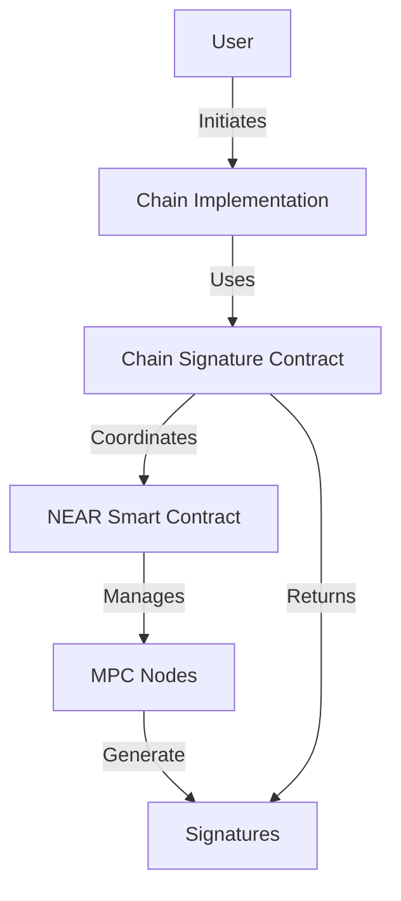

# Multi-Party Computation (MPC) Overview

This guide explains how the MPC system works in the multichain-tools library and how it's used for secure key management and transaction signing.

## What is MPC?

Multi-Party Computation (MPC) is a cryptographic technique that allows multiple parties to jointly compute a function over their inputs while keeping those inputs private. In our context, MPC is used for:

1. Secure key generation and storage
2. Transaction signing
3. Address derivation

The key advantage is that no single party ever has access to the complete private key, making the system more secure against attacks and key compromise.

## Architecture

The MPC system consists of several components:

1. **Chain Signature Contract**: Interface with the MPC infrastructure
2. **Key Management**: Hierarchical deterministic key derivation
3. **Signing Protocol**: Distributed signature generation
4. **NEAR Integration**: Smart contract for MPC coordination



## Key Features

### 1. Hierarchical Key Derivation

```typescript
const { address, publicKey } = await contract.getDerivedPublicKey({
  path: 'm/44/0/0/0',
  predecessor: 'signer.testnet',
})
```

- Supports BIP32-style derivation paths
- Each derived key is controlled by a specific NEAR account
- Public keys can be derived without MPC interaction

### 2. Distributed Signing

```typescript
const signature = await contract.sign({
  payload: [1, 2, 3], // Transaction hash bytes
  path: 'm/44/0/0/0',
  key_version: 1,
})
```

- Signatures are generated collaboratively by MPC nodes
- No single node has access to the complete private key
- Supports multiple signature schemes (ECDSA, EdDSA)

### 3. Security Features

- **Key Versioning**: Support for key rotation
- **Access Control**: NEAR account-based authorization
- **Threshold Signing**: Requires multiple parties to participate
- **Audit Logging**: All operations are recorded on NEAR

## Integration Example

Here's how the MPC system is typically used in a chain implementation:

```typescript
import { ChainSignaturesContract } from '@multichain-tools/utils/near/contract'
import { EVM } from '@multichain-tools/chains/EVM'

// 1. Initialize the contract
const contract = new ChainSignaturesContract({
  networkId: 'testnet',
  contractId: 'mpc.testnet',
  accountId: 'signer.testnet',
  keypair: nearKeyPair,
})

// 2. Initialize a chain implementation
const evmChain = new EVM({
  rpcUrl: 'https://ethereum-rpc.com',
  contract,
})

// 3. Derive an address
const { address, publicKey } = await evmChain.deriveAddressAndPublicKey(
  'signer.testnet',
  'm/44/60/0/0/0'
)

// 4. Create a transaction
const { transaction, mpcPayloads } = await evmChain.getMPCPayloadAndTransaction(
  {
    to: '0x...',
    value: '1000000000000000000',
  }
)

// 5. Sign with MPC
const signature = await contract.sign({
  payload: mpcPayloads[0].payload,
  path: 'm/44/60/0/0/0',
  key_version: 1,
})

// 6. Add signature and broadcast
const signedTx = evmChain.addSignature({
  transaction,
  mpcSignatures: [signature],
})

const txHash = await evmChain.broadcastTx(signedTx)
```

## Security Considerations

### 1. Key Generation

- Keys are generated using secure random number generation
- The generation process is distributed across MPC nodes
- No single node has access to the complete private key

### 2. Key Storage

- Private key shares are stored securely by MPC nodes
- Each share is encrypted at rest
- Access requires NEAR account authentication

### 3. Signing Process

- Transaction payloads are hashed before signing
- Signatures are generated collaboratively
- The process is atomic - it either completes fully or fails

### 4. Access Control

```typescript
// Example of access control in the NEAR contract
function sign(
  payload: number[],
  path: string,
  key_version: number
): Promise<string> {
  // Verify caller has access to the path
  assert(
    this.hasAccess(context.predecessor, path),
    'Unauthorized: Caller does not have access to this path'
  )

  // Continue with signing
}
```

## Best Practices

1. **Path Management**:

   - Use standardized derivation paths (BIP44)
   - Document path assignments
   - Implement path access control

2. **Error Handling**:

   - Handle MPC-specific errors
   - Implement proper fallbacks
   - Log signing failures

3. **Security**:

   - Regular key rotation
   - Monitor signing operations
   - Implement rate limiting

4. **Testing**:
   - Test with multiple MPC nodes
   - Verify signature validity
   - Check access control

## Troubleshooting

Common issues and solutions:

1. **Signature Generation Fails**:

   - Check NEAR account permissions
   - Verify derivation path
   - Ensure sufficient gas for contract calls

2. **Invalid Signatures**:

   - Verify payload format
   - Check key version
   - Confirm path matches chain

3. **Access Denied**:
   - Check NEAR account authorization
   - Verify contract deployment
   - Confirm path permissions
